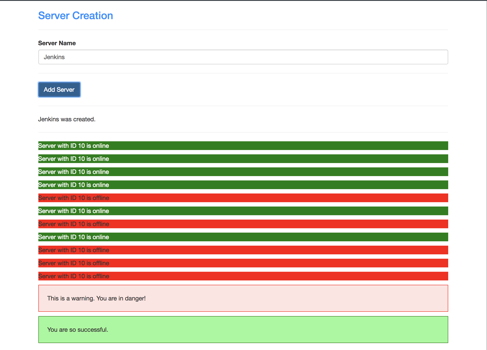

# First Angular App

This project was built with [Angular 4](https://angular.io/) in order to learn the basics of the framework. User can "build a server" and, using two-way databinding, dynamically display the name of the created server in the DOM.

## Screenshot


## Installation
```
git clone https://github.com/mkhira2/first-angular-app.git
cd first-angular-app
npm install
ng serve
```
